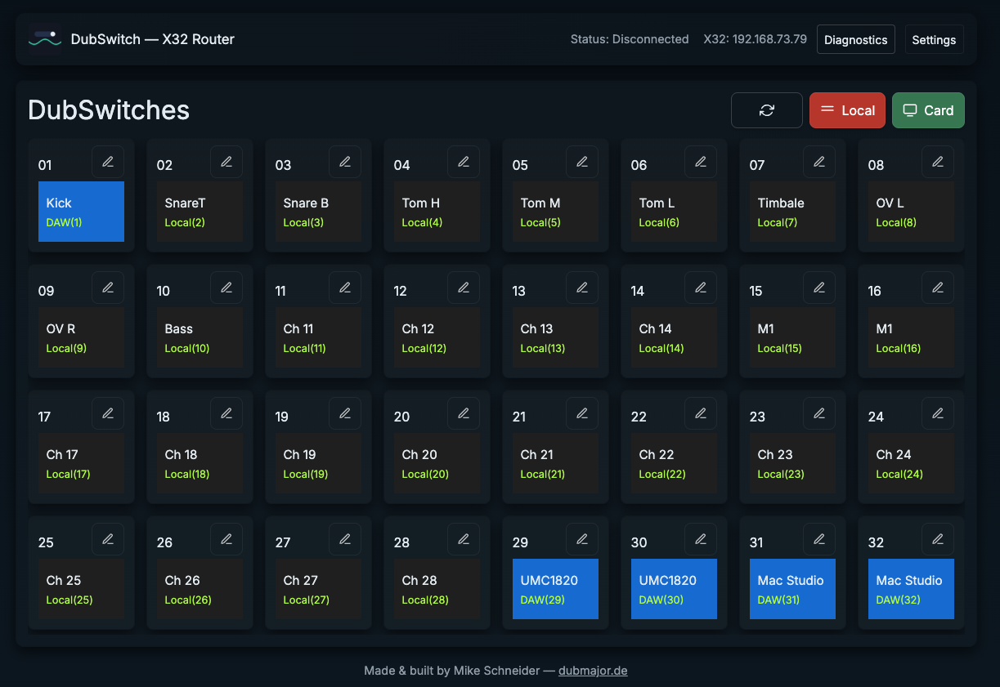

# dubswitch — X32 Channel & User-Patch Router

<p align="center">
  
</p>


DubSwitch is a lightweight cross-platform Electron application for routing inputs and user-patches on Behringer X32 / M32 consoles. It provides an easy-to-use web UI and OSC interface to map channels, switch patches, and manage routing rules from your desktop. The packaging ensures the app works offline (vendored CSS, embedded resources), and includes tools for creating distributable ZIPs / installers for macOS, Windows and Linux.

First release — by Mike Schneider ([dubmajor.de](https://dubmajor.de))

Dubswitch is a lightweight cross-platform Electron application for routing inputs and user-patches on Behringer X32 / M32 consoles. It provides an easy-to-use web UI and an OSC interface to map channels, switch patches, and manage routing rules from your desktop.

The project includes helper scripts and a packaging flow that produces ZIP archives and platform installers. For convenience the UI ships with vendored Bootstrap and jQuery so it can run offline without external CDN dependencies.

## Features
- Electron/Node.js app for X32 input routing and OSC command panel
- Editable channel names, color feedback, collapsible panels
- Versioning and release info displayed in footer
- Connection and routing state dialogs for user guidance

## Installation & Build

Quick start for development:

If you want to compile the project yourself:

1. **Clone the repository:**
	```bash
	git clone https://github.com/MMSchneider/dubswitch.git
	cd dubswitch
	```
2. **Install dependencies:**
	```sh
	npm install
	```
3. **Run the app in development mode:**
	```sh
	npm start
	```
Packaging

- There are convenience npm scripts to package the app for different platforms (see `package.json`).
- The repo also contains `createRelease.sh`, a helper script that runs the packager and creates ZIP artifacts under `dist-release-*`.
- Note: On macOS the script intentionally skips Debian (.deb) creation if the host lacks `fakeroot` / `dpkg-deb`. Create .deb packages on Linux or inside a container/CI instead.

For other platforms, adjust the packaging command as needed (see package.json scripts).

## Versioning

- Version is managed in `package.json` and displayed in the app footer.
- Tag releases in git for each published version (e.g. `v0.1.0`).
- Work on new features in separate branches and open pull requests for review.

## Development Workflow
## Development workflow

1. Create feature branches for new work: `git checkout -b my-feature`
2. Open a pull request and merge into `main` for releases.
3. Use `.gitignore` and `.vscode/settings.json` to keep repo clean.
4. Tag releases: `git tag v0.1.0 && git push --tags`.

## Publishing
Publishing

- Push to your GitHub repository (e.g. `github.com/MMSchneider/dubswitch`).
- Update `package.json`'s `version` and create a matching git tag when publishing a release.

---
© 2025 Mike Schneider. All rights reserved.
