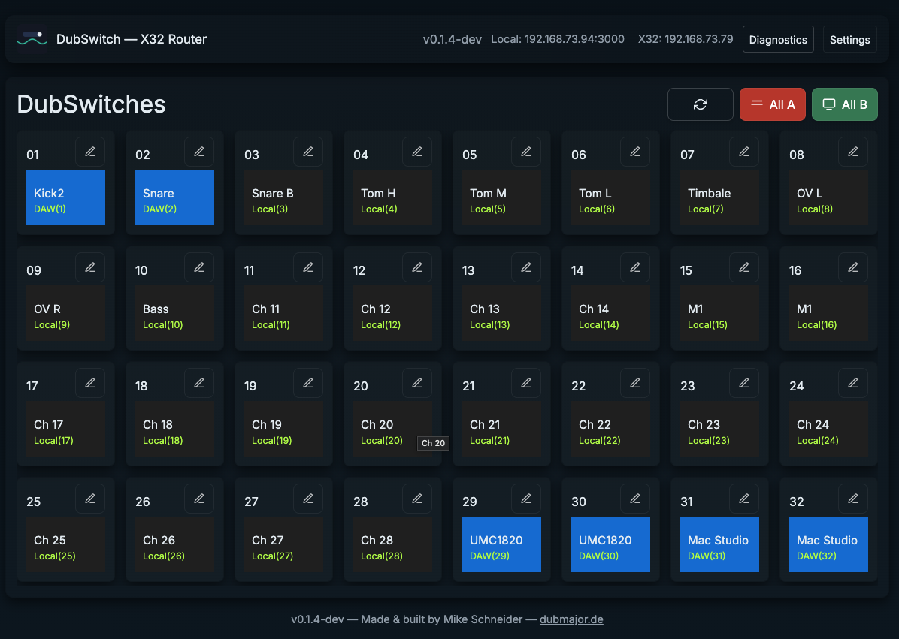
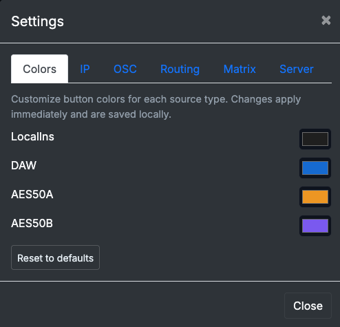
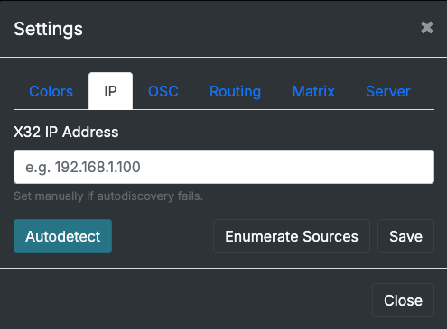
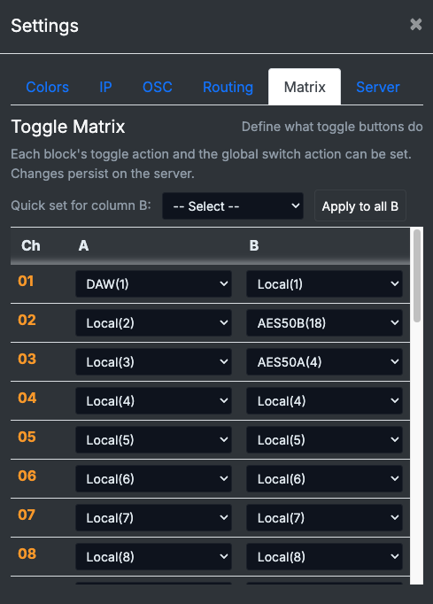
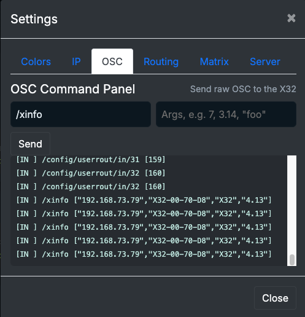
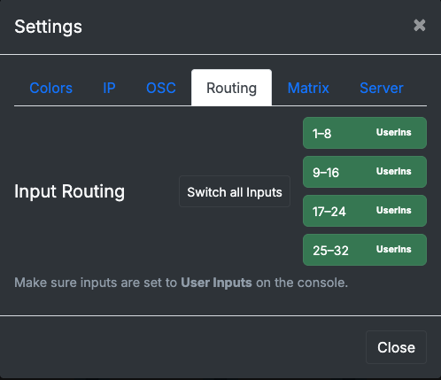
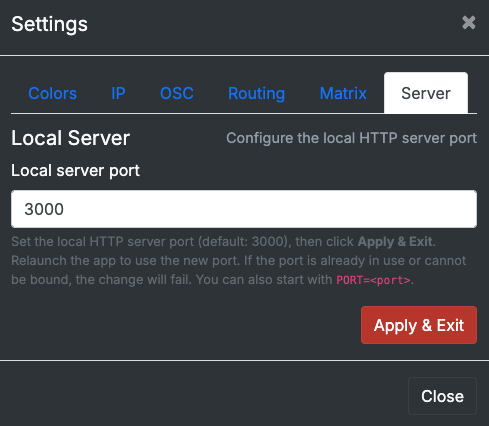

# 🎛 DubSwitch — Per-Channel Routing & Overdub Tool for X32/M32



[](LICENSE)


DubSwitch is the missing link between your **Behringer X32 / Midas M32** and your DAW.  
It gives you **per-channel input control** and a flexible **A/B Toggle Matrix**, so you can flip any channel between two user-defined sources — **Local**, **DAW (Card)**, **AES50-A**, **AES50-B** — with one click.

With DubSwitch, overdubbing becomes effortless: record on Local inputs, flip finished channels to DAW playback, and keep recording new parts — **without touching X32 scenes or user-input blocks.**

---

## 🚀 Key Features

### 🔄 Per-Channel A/B Toggle Matrix
- **Any two sources per channel:** Local, DAW, AES50-A, AES50-B.
- **Instant flip:** Click to switch from A → B (or back) in real-time.
- **Quick apply:** Apply a preset to all B-columns in one click.
- **Session recall:** Save and reload matrices for different projects.

### 🎨 Customizable Visuals
- **Color-coded buttons** for each source type (fully user-configurable).
- **Immediate feedback** of which source is active per channel.

### ⚡ Smart Setup & Discovery
- **Autodetects your X32** on the same subnet.
- Manual IP entry if autodiscovery fails.
- **Reads channel names** from X32 on startup.
- **Inline channel name editor** to keep your session organized.

### 🛠 Essential Tools for Power Users
- **OSC Command Panel** to send raw OSC commands and debug routing.
- **Routing Helper** — one-click setup to switch console input blocks (1–8, 9–16, etc.) to *UserIns* (required for operation).
- **Diagnostics panel** — shows connection status, firmware info, and OSC traffic.

### 🌐 Flexible Server Setup
- **Change local Node server port** if port 3000 is already taken.
- **Apply & restart** directly from the UI.

### 💻 Cross-Platform & DAW-Agnostic
Works on macOS, Windows, and Linux.  
Compatible with any DAW that can use the X32/M32 as a multichannel USB/FireWire interface (Logic, Cubase, Reaper, Studio One, Ableton Live, etc.).

---

## 🎯 Typical Workflow

1. **Track Drums:** Record CH1–8 on Local inputs.
2. **Flip to Playback:** Switch CH1–8 to DAW (Card) using DubSwitch.
3. **Overdub Guitars/Vocals:** Keep CH9–12 on Local, record new takes while drums play back from DAW.
4. **Layer & Repeat:** Flip other channels as needed — all with per-channel control.

---

## 🖼 Screenshots

### Main Interface


### Settings: Colors


### Settings: IP Autodetect


### Settings: Matrix (A/B Sources)


### Settings: OSC Panel


### Settings: Routing Helper


### Settings: Server Port


---

## 🖼 Settings Overview

| Tab     | Purpose |
|--------|---------|
| **Colors** | Customize button colors for Local, DAW, AES50-A, AES50-B. |
| **IP** | Autodetect X32, manually set IP, enumerate sources. |
| **OSC** | Send raw OSC commands directly, monitor incoming/outgoing messages. |
| **Routing** | Ensure console input routing is set to UserIns for proper operation. |
| **Matrix** | Define channel A/B source pairs, quick apply for all B channels. |
| **Server** | Change local HTTP server port, apply & restart. |

---

## 🧠 Why It’s Different

Unlike block-based routing on the X32, **DubSwitch works at the per-channel level**, letting you create hybrid routing setups on the fly without touching scenes or user blocks.  
This means:
- ✅ **No re-patching**
- ✅ **No lost EQ/comp settings**
- ✅ **No complex routing gymnastics**

---

## 🎤 Perfect For

- Bands doing **layered overdubs** in project studios.
- Engineers mixing **live inputs with DAW playback**.
- Users running **AES50 stageboxes** and Local inputs simultaneously.
- Power users who want **fast, safe, recallable routing changes**.

---

## 🛠 Installation & Setup

1. **Clone the repository**
    ```sh
    git clone https://github.com/yourusername/dubswitch.git
    cd dubswitch
    ```
2. **Install dependencies**
    ```sh
    npm install
    ```
3. **Run the app**
    ```sh
    npm start
    ```
4. **Connect to your X32**
   - Make sure your console is set to use **User Inputs** for channels 1–32.
   - Launch DubSwitch, click **Autodetect**, or manually enter the X32 IP.
   - Use the **Matrix** tab to configure A/B sources per channel.

---

## 📘 Quick Reference

- **A/B Toggle** — click any channel to flip between two sources.
- **All A / All B** — one-click global switch for all channels.
- **Edit Channel Name** — click the pencil icon on any channel block.
- **Colors Tab** — customize button colors for better visual grouping.
- **OSC Tab** — send manual commands for testing or debugging.

---

## 🤝 Contributing

Pull requests and feature requests are welcome!  
Please open an issue first to discuss what you’d like to change.

---

## 📜 License

MIT — see [LICENSE](LICENSE) for details.

---

Made & built by **Mike Schneider** — [dubmajor.de](https://dubmajor.de)
